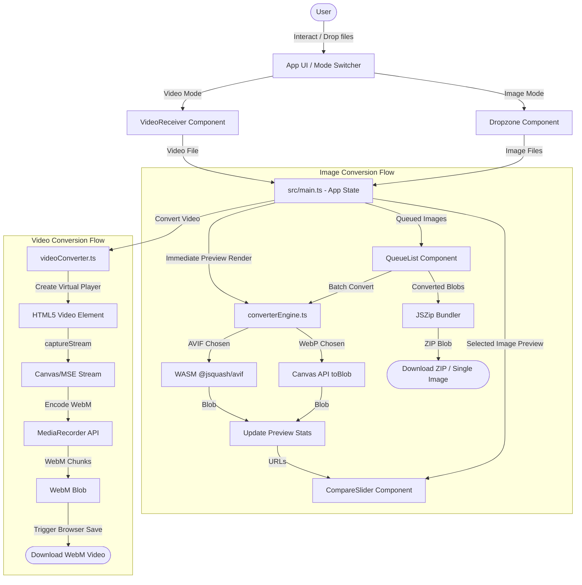

# OptiShift | Premium Local-First Media Optimizer & Converter

OptiShift is a high-fidelity, local-first media optimization and conversion web application. It enables developers and creators to convert and compress standard images (**PNG**, **JPG**, **JPEG**) into next-generation formats (**WebP**, **AVIF**), and videos (**MP4**, **WebM**, **MOV**, **AVI**) into high-performance **WebM** containers directly inside their browser.

Since all media processing is performed client-side using the browser canvas, WebAssembly (WASM), and browser encoding interfaces, **no files are ever uploaded to a server**. This guarantees 100% data privacy, maximum security, and offline utility.

---

## What is this Project?

OptiShift is designed to solve the overhead of remote media compression by running all conversion pipelines natively on the user's hardware. 

### Key Features:
- **100% Client-Side Processing**: Zero server uploads. Heavy calculations run locally.
- **Next-Gen Image Formats**: Convert standard image formats to high-compression WebP and AVIF.
- **WASM-Powered AVIF Encoding**: Native browser engines do not support direct canvas encoding to AVIF. OptiShift uses `@jsquash/avif` (compiled to WebAssembly) to achieve high-quality AVIF encoding inside the browser.
- **Browser-Native Video Converter**: Re-encodes videos (MP4, MOV, WebM, AVI) to WebM locally using HTML5 virtual video streams, the `captureStream()` API, and the browser's `MediaRecorder` engine with VP8/VP9 hardware-negotiated codecs.
- **Interactive Visual Comparison Slider**: A split-screen compare slider that permits real-time previewing of quality loss and compression ratios before exporting.
- **Batch Image Processing Queue**: Queue multiple image assets, customize quality metrics, and batch-convert them into a single `.zip` bundle.
- **Sleek Cyber-Dark UI**: Responsive layout featuring CSS glassmorphism, visual indicators, status badges, and fine-grained slider inputs.

---

## System Flow & Architecture

OptiShift coordinates components through state updates handled in the main controller, delegating intensive compression routines to local browser web-workers or browser hardware interfaces.

### Media & Control Flow Diagram



### Module Breakdown

1. **App Controller (`src/main.ts`)**
   - Coordinates file ingestion, UI rendering modes, active preview selections, slider synchronization, and triggers batch actions.
2. **Image Conversion Engine (`src/utils/converterEngine.ts`)**
   - Handles canvas resizing, scaling ratios, native WebP canvas conversion, and handles WebAssembly compilation calls to `@jsquash/avif`.
3. **Video Conversion Engine (`src/utils/videoConverter.ts`)**
   - Renders video inputs inside a hidden playback interface, feeds the stream into a native `MediaRecorder` pipeline, and writes WebM chunks.
4. **Compare Slider (`src/component/CompareSlider.ts`)**
   - Uses mouse and touch position listeners to slide between the source image overlay and compressed previews in real-time.
5. **Dropzones & Queue Managers (`src/component/`)**
   - Manage drag-and-drop actions, UI file inputs, state tracking variables (`pending`, `processing`, `success`, `failed`), and DOM nodes.

---

## How to Run Locally

### Prerequisites
- **Node.js** (v18.0.0 or higher)
- **npm** (v9.0.0 or higher)

### 1. Clone the Repository
```bash
git clone https://github.com/SERAVEEM/Image-Converter-.git
cd "image-converter"
```

### 2. Install Dependencies
```bash
npm install
```

### 3. Start local development server
```bash
npm run dev
```
Once started, the development server will serve the client-side bundle locally. Open `http://localhost:5173/` in your browser.

### 4. Build and Preview for Production
To test production optimization rules locally:
```bash
npm run build
npm run preview
```
This builds static artifacts into `dist/` and runs a local preview server mimicking standard hosting behaviors.

---

## How to Contribute

We welcome contributions to OptiShift! Follow these guidelines to maintain project quality.

### Core Architectural Rules
- **100% Client-Side**: No features should depend on remote servers, APIs, or databases. All computations must happen in the browser.
- **TypeScript First**: All components and helpers must be written in strongly-typed TypeScript.
- **Modular Stylesheets**: Styles are organized into specific modules under `src/styles/` (e.g., `inputs.css`, `cards.css`). Do not use TailwindCSS or utility libraries; write raw, high-performance modular CSS.
- **Performance & Security First**: Avoid heavy dependencies. Check if standard browser APIs (like Canvas, MediaRecorder, or JSZip) cover requirements before installing packages.

### Development Workflow
1. **Fork the Repository**: Create a fork of the repository on GitHub.
2. **Create a Feature Branch**:
   ```bash
   git checkout -b feature/your-awesome-feature
   ```
3. **Make and Test Your Changes**:
   - Write clean, documented code.
   - Test changes across multiple browsers (specifically Canvas rendering and video codec compatibility in Chrome/Safari/Firefox).
4. **Verify the Production Build**:
   Ensure TypeScript checking and Vite compilation pass cleanly without errors:
   ```bash
   npm run build
   ```
5. **Commit and Push**:
   Keep commit messages brief and descriptive:
   ```bash
   git commit -m "feat: add video bitrate selector custom input"
   git push origin feature/your-awesome-feature
   ```
6. **Submit a Pull Request**: Submit a PR to the main branch detailing the purpose and validation of your changes.
