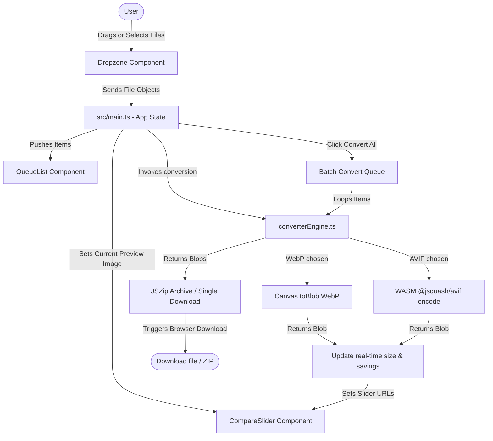

# OptiShift | Premium Local-First Image Converter

OptiShift is a high-fidelity, local-first image optimization and conversion web application. It allows users to convert standard web formats (**PNG**, **JPG**, **JPEG**) into next-generation formats (**WebP**, **AVIF**) directly in their browser. 

Since all image processing is performed client-side using the browser canvas and WebAssembly (WASM), **no images are ever uploaded to a server**, ensuring 100% privacy, data security, and offline usability.

---

## Features

- **100% Client-Side Processing**: Zero server uploads. Heavy operations run locally.
- **Next-Gen Formats**: Convert images to WebP and AVIF.
- **WASM-Powered AVIF Encoding**: Native browser engines do not support encoding to AVIF on a canvas. OptiShift uses `@jsquash/avif` (compiled to WebAssembly) to encode high-quality AVIF files directly in the browser.
- **Interactive Visual Comparison Slider**: A draggable side-by-side slider to inspect the compressed output quality in real time before exporting.
- **Real-Time Statistics**: Real-time display of original size, estimated compressed size, and percentage savings as quality and format parameters are changed.
- **Multi-File Batch Queue**: Drop multiple files to queue them up. Process all files in one go.
- **Zip Export**: Automatically bundles multiple converted images into a single `.zip` archive for easy downloading.
- **Modern Cyber-Dark UI**: Glassmorphic styling, custom sliders, responsive layouts, and smooth micro-animations.

---

## Tech Stack and Architecture

- **Core Framework**: Vite + TypeScript (running under modern standard ES module bundler setup).
- **Styles**: Modular Vanilla CSS imports.
- **AVIF Compression**: WebAssembly (`@jsquash/avif`).
- **ZIP Packaging**: `JSZip`.
- **Canvas Rendering**: HTML5 Canvas API for resizing/WebP conversion.

### File Structure

```text
d:/image converter/
├── index.html                   # HTML structure and UI container shell
├── package.json                 # Project configuration & npm scripts
├── plan.md                      # Original project design and specification
├── tsconfig.json                # TypeScript compiler options
├── vite.config.ts               # Vite server configurations (worker & dep optimization rules)
└── src/
    ├── main.ts                  # App controller and coordinator
    ├── style.css                # CSS entrypoint importing modular stylesheets
    ├── jsquash-avif.d.ts        # TS declarations for WebAssembly AVIF encoder
    ├── assets/                  # Default assets and typescript logo SVG
    ├── component/               # UI components
    │   ├── CompareSlider.ts     # Visual comparison before-after slider logic
    │   ├── Dropzone.ts          # Drag-and-drop / file browser controller
    │   └── QueueList.ts         # Visual list displaying queue, progress, and success/fail metrics
    ├── styles/                  # Modular Vanilla CSS stylesheets
    │   ├── variables.css        # Palette configuration (HSL variables & dark mode variables)
    │   ├── reset.css            # Base resets
    │   ├── layout.css           # Workspace structural layouts (grid & flex items)
    │   ├── cards.css            # Glassmorphic card styling
    │   ├── buttons.css          # Control triggers and format button groups
    │   ├── badges.css           # Badges for status, offline labels, and savings statistics
    │   ├── inputs.css           # Sliders and range inputs
    │   ├── dropzone.css         # Visual styling for drop zones
    │   ├── comparison.css       # Slider containers and statistics preview panels
    │   └── queue.css            # Queue lists and progress indicators
    └── utils/                   # Utilities & engine APIs
        ├── converterEngine.ts   # Core canvas scaling and WASM AVIF converter pipeline
        └── fileHelpers.ts       # Byte sizing layout helpers and browser file download routines
```

### Component Flow Architecture



---

## Setup and Installation

### Prerequisites

You must have **Node.js** (v18 or higher recommended) and **npm** installed on your machine.

### 1. Clone & Enter Directory

```bash
git clone https://github.com/SERAVEEM/Image-Converter-.git
cd "d:/image converter"
```

### 2. Install Dependencies

```bash
npm install
```

### 3. Start Development Server

```bash
npm run dev
```

The app will run locally at `http://localhost:5173/`. Open this URL in a modern web browser (Chrome, Edge, or Firefox).

### 4. Build for Production

To bundle the application for production deployment:

```bash
npm run build
```

This creates a static production bundle in the `dist/` directory, which can be hosted on any static file server (Netlify, Vercel, GitHub Pages, etc.).

---

## Core Modules Breakdown

### 1. Conversion Engine (`src/utils/converterEngine.ts`)

Converts a `File` object using custom option inputs:
- **WebP Encoding**: Handled natively by the browser's Canvas API:
  ```typescript
  canvas.toBlob((blob) => { ... }, 'image/webp', quality);
  ```
- **AVIF Encoding**: Handled by `@jsquash/avif` since browsers don't support native canvas encoding to AVIF.
  - Draws the image to canvas at the scaled size.
  - Extracts the raw `ImageData` via `ctx.getImageData(...)`.
  - Dynamically imports the WASM AVIF encoder module.
  - Maps user quality (`0.0` - `1.0`) to standard AVIF `cqLevel` (`63` - `0` where 0 is lossless/best quality and 63 is lowest).
  - Performs multi-threaded WASM compilation and produces an `ArrayBuffer` which is wrapped in an `image/avif` MIME Blob.

### 2. Comparison Slider (`src/component/CompareSlider.ts`)

Features a split comparison slider:
- Displays the original image on the left and the compressed output on the right.
- Uses mouse and touch movement listeners (`mousedown`, `mousemove`, `mouseup`, `touchstart`, `touchmove`, `touchend`) to adjust the split percentage.
- Dynamically resizes the overlay width (`afterWrapperEl.style.width`) and handle position in real-time, functioning natively on desktop and mobile screens.

### 3. Queue Manager (`src/component/QueueList.ts`)

Manages and displays multiple files queued for conversion:
- Tracks individual file state (`pending`, `processing`, `success`, `failed`).
- Computes progress and displays real-time layout updates inside the sidebar.
- Computes actual byte size savings (e.g. `Saved 82%`) and formats values dynamically using helper routines.

### 4. Style Customization (`src/styles/variables.css`)

OptiShift leverages a variable-driven CSS ecosystem that implements:
- A dark backdrop (`#070a13`).
- Semitransparent cards using `backdrop-filter: blur(12px)` and subtle glowing borders (`var(--border-color-glow)`).
- Distinct color accents representing statuses (`--color-success` for green, `--color-error` for red, `--color-primary` for indigo).
- Custom Google Font `Outfit` to deliver premium visual aesthetics.

---

## Security and Privacy

Since OptiShift performs all compression tasks using the CPU and GPU of the local client machine:
- **No data leaves your device**.
- No telemetry, analytics, or image caching tracking scripts are embedded.
- Can run fully offline in a sandbox or flight mode after loading.
